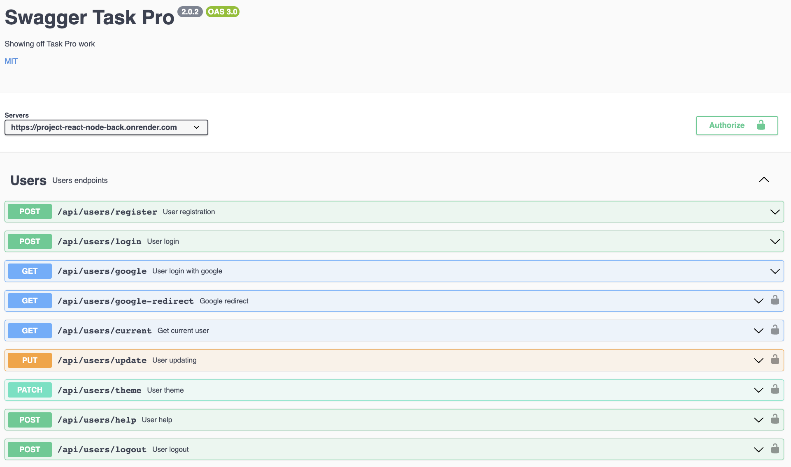
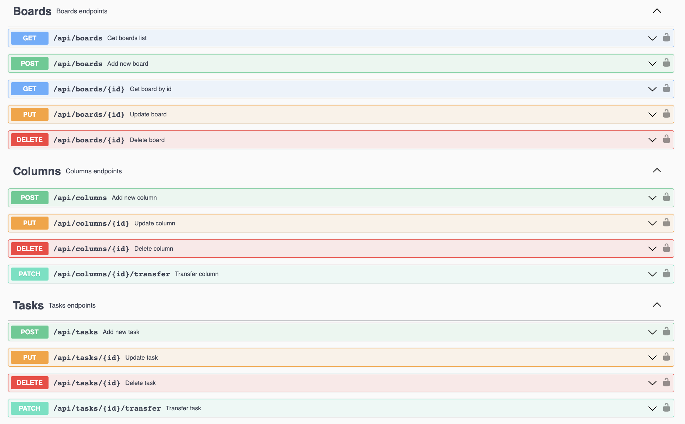

# Backend API "TaskPro"

This repository contains the TaskPro Backend API project, which provides an API for interacting with the TaskPro application.

## Project Overview

This project implements the server-side component of the TaskPro application. It is built on Node.js, utilizing the Express.js framework to implement the API and Mongoose for interacting with the MongoDB database.

## Technologies Used

Here are some of the key technologies and libraries used in this project:

- 
- 
- 
- 
- 
- 
- 
- 
- 
- 
- 
- 
- 
- 
- 
- 
- 
- 
- 

## API Documentation

For detailed descriptions of API requests and interactions, refer to the documentation:

[TaskPro API Documentation](https://project-react-node-back.onrender.com/api-docs)

## Requirements

Before getting started with the project, make sure you have the following tools installed on your computer:

- Node.js (version 12 or higher)

## Installation

1. Clone this repository to your local computer.
2. Open the terminal and navigate to the root folder of the project.
3. Run the command `npm install` or `yarn` to install project dependencies.

## Configuration

1. Create a .env file in the project's root folder, based on the .env.example file.
2. Specify the necessary environment variables in this file.

## Server Commands

**npm:**

- `npm start` — Start the server in production mode.
- `npm run start:dev` — Start the server in development mode.
- `npm run lint` — Run code linting using eslint. Perform this before each PR and fix all linting errors.
- `npm run lint:fix` — Similar to lint command, but automatically fixes simple linting errors.

**yarn:**

- `yarn start` — Start the server in production mode.
- `yarn start:dev` — Start the server in development mode.
- `yarn lint` — Run code linting using eslint. Perform this before each PR and fix all linting errors.
- `yarn lint:fix` — Similar to lint command, but automatically fixes simple linting errors.
